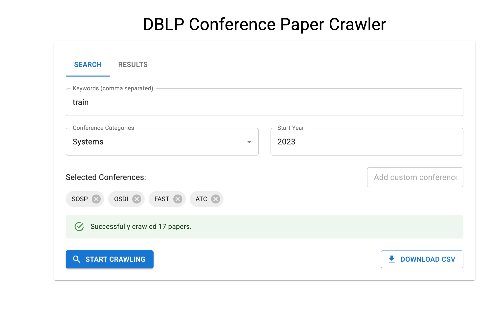

# DBLP Conference Paper Crawler



A modern GUI application for crawling academic papers from DBLP based on keywords and conferences.

## Features

- Modern, responsive UI built with React and Material UI
- Search papers by keywords across multiple conferences
- Pre-defined conference categories (Database, Systems, Machine Learning, etc.)
- Filter papers by start year
- View paginated results directly in the UI
- Download results as CSV

## Installation

### Backend Setup

1. Set up Python environment:

```bash
# Create and activate a virtual environment (optional but recommended)
conda create -n myenv python=3.12
conda activate myenv  # On Windows: venv\Scripts\activate

# Install backend dependencies
pip install -r requirements.txt
```

2. Run the backend server:

```bash
cd backend
uvicorn main:app --reload
```

The backend should now be running at http://localhost:8000

### Frontend Setup

1. Install Node.js dependencies:

```bash
cd frontend
npm install
```

2. Run the frontend development server:

```bash
npm start
```

The frontend should now be running at http://localhost:3000

## Usage

1. Enter keywords (comma-separated) to search for in paper titles
2. Select a conference category to automatically populate the conferences list
3. Set the start year to filter papers by publication date
4. Click "Start Crawling" to begin the search
5. View the results in the Results tab when crawling completes
6. Download the full results as CSV using the Download button

## Future Enhancements

- [ ] Add more conference support (referencing [ccf deadline]())
- [ ] Implement multi-processing for faster crawling
- [ ] Add more filter options
- [ ] Visualize publication trends over time
